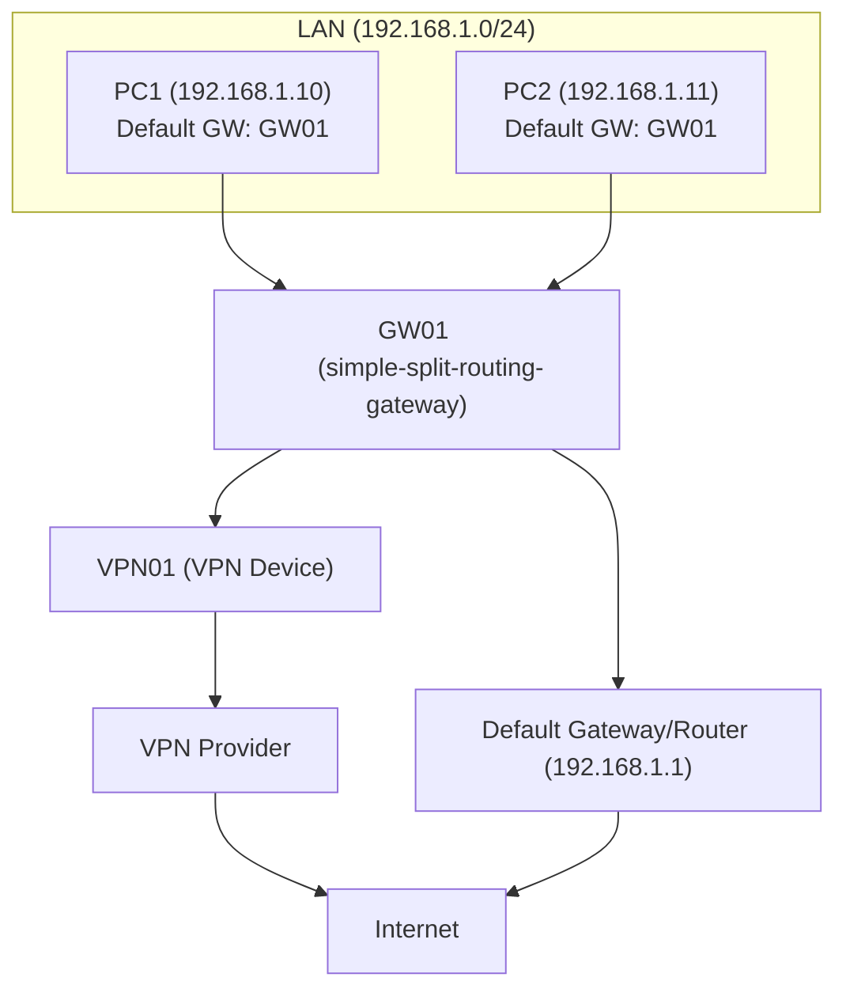

# Simple-Split Routing Gateway


This project lets you set up an Ubuntu system as a split-routing gateway. You can route specific domains, IPs, or ranges through a "special gateway" and send all other traffic through your normal default gateway. The system is designed for reliability, with fast route restore at boot and automatic refresh every few hours.



- Routes selected traffic (domains, IPs, or ranges) through a configurable special gateway (`SPECIAL_GW`)
- Sends all other traffic through your default gateway (`DEFAULT_GW`)

NAT (masquerading) is enabled so that return traffic is handled correctly.

**Fast Route Restore:**
Routes for previously resolved domain IPs are cached and instantly loaded at boot, so routing is available even before DNS is ready. The script then refreshes the IPs and routes in the background, keeping everything up to date.

---


## What's Included

- **Config file:** `/var/lib/simple-split-routing-gateway/config.conf`  
  Set your interface, gateway IPs, domain list path, logging, and dry-run mode.
- **Domain list:** `/var/lib/simple-split-routing-gateway/domains.txt`  
  One entry per line: domain, IP address, or CIDR range. Routed via the special gateway.
- **Setup/init script:** `/usr/local/bin/simple-split-routing-gateway/init-setup`  
  One-time setup: enables IP forwarding, installs nftables, writes nftables config.
- **Boot/refresh script:** `/usr/local/bin/simple-split-routing-gateway/route-refresh`  
  Handles routing, domain resolution, and route caching. Run at boot and by timer.
- **Route cache:** `/var/lib/simple-split-routing-gateway/domain-ip-cache`  
  Stores the last resolved IPs for each domain for instant route restore at boot.
- **Systemd service & timer:**  
  - `/etc/systemd/system/simple-split-routing-gateway-refresh.service`  
  - `/etc/systemd/system/simple-split-routing-gateway-refresh.timer`  
  Runs the script at boot and daily to keep routes up to date.

---


## Installation & Usage


### Quick Install Summary

1. Install required packages
2. Extract the package to a working directory
3. Copy files to their system locations
4. Make scripts executable
5. Edit your config and domain list
6. Run the initial setup
7. Enable and start the systemd timer
8. Verify everything is working

See below for detailed steps.

### 1. Prerequisites
- Ubuntu 20.04 or later
- Root or sudo access
- Packages: `nftables`, `dnsutils`, `unzip`

Install prerequisites:
```bash
$ sudo apt update
$ sudo apt install -y nftables dnsutils unzip
```


### 2. Extract the files

Extract the package to a working directory (not directly to `/`):
```bash
$ unzip gateway_setup_package.zip -d ~/gateway_setup_tmp
$ cd ~/gateway_setup_tmp
```

### 3. Move files to system locations

Copy the files to their required locations (requires sudo):
```bash
# Scripts
$ sudo mkdir -p /usr/local/bin/simple-split-routing-gateway
$ sudo cp usr/local/bin/simple-split-routing-gateway/* /usr/local/bin/simple-split-routing-gateway/

# Config, domains, and cache directory
$ sudo mkdir -p /var/lib/simple-split-routing-gateway
$ sudo cp var/lib/simple-split-routing-gateway/* /var/lib/simple-split-routing-gateway/

# Systemd units
$ sudo cp etc/systemd/system/simple-split-routing-gateway-refresh.* /etc/systemd/system/
```

If you get a permissions error, check that you are using `sudo` and that the destination directories exist.

### 4. Set permissions

Make all scripts in the bin directory executable:
```bash
$ sudo chmod +x /usr/local/bin/simple-split-routing-gateway/*
```

### 5. Configure

Edit `/var/lib/simple-split-routing-gateway/config.conf` and `/var/lib/simple-split-routing-gateway/domains.txt` as needed for your environment (see Configuration section below).
If you are unsure, start with the provided examples and adjust as needed.

### 6. Run initial setup (one-time)

This enables IP forwarding, sets up nftables, and applies initial routes:
```bash
$ sudo /usr/local/bin/simple-split-routing-gateway/init-setup
```
If you see errors about missing commands, double-check that all prerequisites are installed.

### 7. Enable and start the systemd timer

This ensures routes are refreshed at every boot and every 4 hours:
```bash
$ sudo systemctl daemon-reload
$ sudo systemctl enable --now simple-split-routing-gateway-refresh.timer
# The timer will trigger the refresh service automatically at boot (after 10 seconds) and every 4 hours.
```
**How it works:**
- The timer unit (`simple-split-routing-gateway-refresh.timer`) is enabled and started. This schedules the refresh service to run 10 seconds after every boot and then every 4 hours.
- The service unit (`simple-split-routing-gateway-refresh.service`) is not enabled directly; it is triggered by the timer.
- You do not need to enable the service itself—only the timer.

**To verify the timer is active and scheduled:**
```bash
$ systemctl list-timers --all | grep simple-split-routing-gateway
```
You should see the next scheduled run and the last activation time.

**To check if the service ran at boot:**
```bash
$ journalctl -u simple-split-routing-gateway-refresh.service --since "today"
```
This will show logs from the service, including any errors or output from the route refresh script.

**To manually trigger a refresh:**
```bash
$ sudo systemctl start simple-split-routing-gateway-refresh.service
```

If you make changes to the systemd unit files, always run `sudo systemctl daemon-reload` again.

### 8. Verify installation

- Check timer status and next run:
  ```bash
  $ systemctl list-timers --all | grep simple-split-routing-gateway
  ```
- Check routing rules:
  ```bash
  $ ip route show
  ```
- Check nftables rules:
  ```bash
  $ sudo nft list ruleset
  ```
- View logs:
  ```bash
  $ sudo tail -f /var/log/simple-split-routing-gateway.log
  ```

If you encounter issues, see the Troubleshooting section below. Common issues include:
- Permissions errors (try using `sudo`)
- Systemd timer not running (check with `systemctl list-timers`)
- Missing dependencies (install with `apt`)


---

## Configuration


### Example: config.conf

```ini
# Network interface to use for routing
INTERFACE="eth0"

# Default gateway for all other traffic
DEFAULT_GW="<your-default-gateway>"         # e.g. 192.168.1.1

# Special gateway for selected domains/IPs/ranges
SPECIAL_GW="<your-special-gateway>"         # e.g. 10.0.0.1

# Path to the domain/IP/range list
DOMAIN_FILE="/var/lib/simple-split-routing-gateway/domains.txt"

# Log file location
LOGFILE="/var/log/simple-split-routing-gateway.log"

# Enable dry-run mode (true/false)
DRY_RUN=false
```


- **Add or remove domains, IPs, or ranges:**  
  Edit `/var/lib/simple-split-routing-gateway/domains.txt`. One entry per line. You can specify a domain name, an IP address, or a CIDR range. Lines starting with `#` are comments and ignored. Blank lines are ignored.

  **Examples:**
  ```
  # Example domain list
  ifconfig.co
  8.8.8.8
  192.168.1.0/24
  # This is a comment
  example.com
  
  # Blank lines are ignored
  ```

- **Modify interface or gateways:**  
  Edit `/var/lib/simple-split-routing-gateway/config.conf`

- **Dry-run mode:**  
  Set `DRY_RUN=true` in config file to preview commands without applying changes.

---


## Notes

- The setup/init script requires `nftables` and writes persistent config.
- The refresh script requires `dig` (from `dnsutils` package`).
- The setup script enables IP forwarding persistently.
- The systemd timer updates routes every 4 hours to handle DNS IP changes.
- Routes for domain IPs are cached and restored instantly at boot for fast network readiness.
- Only outbound traffic routing is supported.

---


## Troubleshooting

- Ensure network connectivity to default gateway.
- Verify domain names are correct and resolve properly.
- Check `journalctl -u simple-split-routing-gateway-refresh.service` for errors and output.
- Use dry-run mode to debug.
- If routes do not appear instantly after boot, check the cache file at `/var/lib/simple-split-routing-gateway/domain-ip-cache` and confirm the timer/service ran by checking logs as above.
- If nftables or IP forwarding is not working, re-run `/usr/local/bin/simple-split-routing-gateway/init-setup`.